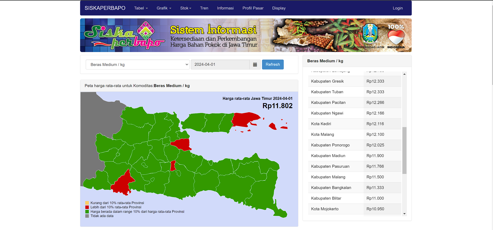

# Siskaperbapo Scaper

<div style="text-align:center;">
    
</div>


Sikaperbapo ini merupakan sistem informasi ketersediaan dan perkembangan
Harga Bahan pokok di jawa timur

## Fitur
- **Data Real-Time** : mendapatkan informasi-informasi tentang ketersedian dan harga bahan pokok.

- **Cakupan Regional**: Data Komuditas ini hanya berfokus pada wilayah Jawa Timur
## Cara Kerja

Siskaperbapo Scraper mengumpulkan data harga komuditas yang ada di jawa timur dari website Siskaperbapo . Data yang terkumpul kemudian diproses dan disajikan dalam format yang mudah digunakan.
## instalisasi

1. Instalasi Paket Python dapat dilakukan dengan   perintah berikut:
    ```sh
    pip install git+https://github.com/kayabaakihiko13/Siskaperbapo_API_PY.git
    ```

2. lalu buka website [SiskaPerbapo](https://siskaperbapo.jatimprov.go.id/)

tampilan page websitenya seperti ini


3. kalau untuk mengetahui harga keselurahan bahan pokok di jawa timur cukup tinggal
```py
from Siskaperbapo.api import CommuditiyEastJava
east_java = CommuditiyEastJava()
# mengetahui harga dari rentang waktu di tentukan sesuai kebutuhan
print(east_java.get_price_province("2024-03-29","2024-04-01"))
```
untuk lengkapnya bisa di lihat [disini](example)

## Berkontribusi
Kami menyambut kontribusi dari komunitas untuk meningkatkan Siskaperbapo Scraper. Jika Anda ingin berkontribusi, silakan ikuti langkah-langkah berikut:

1. Fork repositori
2. change directory seperti ini `cd Siskaperbapo_API_PY/`
3. lalu ketikan perintah `pip install . --break-system-package`
4. Buat branch fitur Anda: `git checkout -b fitur/baru`
5. Commit perubahan Anda: `git commit -am 'Menambahkan beberapa fitur'`
6. Dorong branch Anda: `git push origin fitur/baru`
7. Ajukan pull request